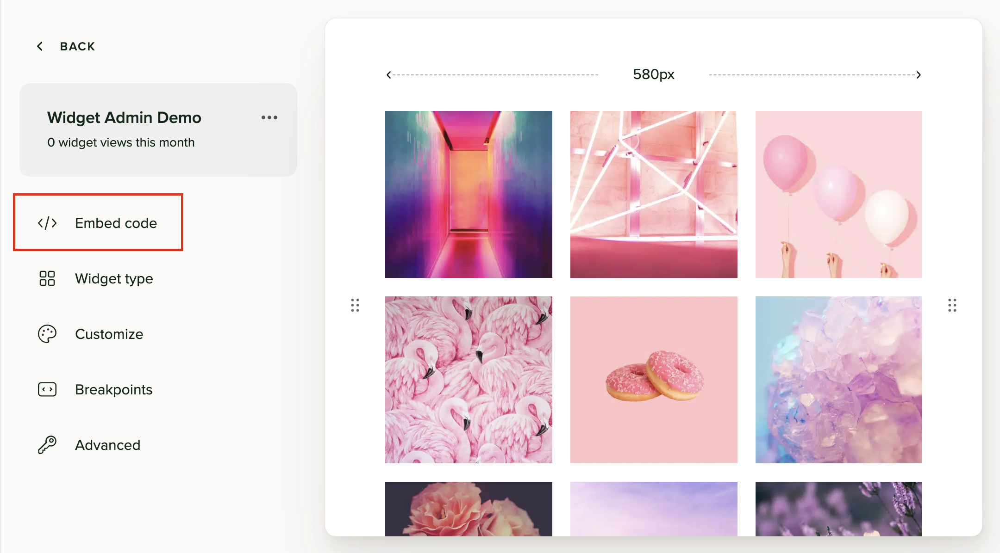
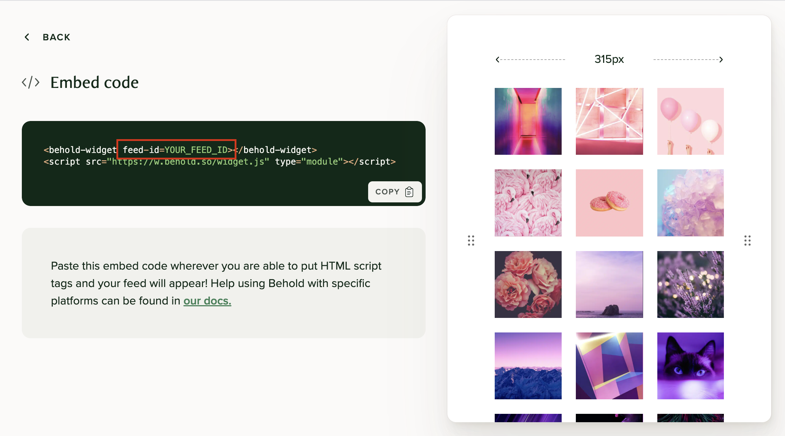

# The official Behold Widget for Svelte

<div align="center">
  <a href="https://behold.so/">
    <picture>
      <source media="(prefers-color-scheme: dark)" srcset="https://raw.githubusercontent.com/BeholdSocial/behold-svelte/main/readme-images/thumbnail-dark.png">
      <source media="(prefers-color-scheme: light)" srcset="https://raw.githubusercontent.com/BeholdSocial/behold-svelte/main/readme-images/thumbnail-light.png">
      
    </picture>
  </a>
</div>

## About

This package contains a Svelte version of the [Behold embedded widget](https://behold.so/docs/widget/). This package is a convenience wrapper around the core Behold widget web component, and allows easy integration into your Svelte projects.

## Installation

Start by installing with your package manager of choice:

```jsx
npm install @behold/svelte

// or
pnpm add @behold/svelte

// or
yarn add @behold/svelte
```

## Usage

### 1. Import the component

```js
import BeholdWidget from "@behold/svelte"
```

### 2. Add to your app

Use it like you would any other Svelte component:

```html
<BeholdWidget feedId="YOUR_FEED_ID" />
```

The Behold widget component accepts a single property: `feedId`, which can be found by opening your feed in the [Behold dashboard](https://app.behold.so) and clicking on "Embed Code".

All configuration and customization is handled in the Behold admin. When you make changes there it will automatically update your widget, no code modifications required. Because of browser caching, changes can take a minute or two to show up. Clearing your cache and incognito/private windows will help.




## Load event

This component emits a load event after its initial render. It can be used as follows:

```js
<BeholdWidget on:load={() => console.log("Loaded!")} feedId="YOUR_FEED_ID" />
```

## A note about SSR

Because these widgets are inherantly dynamic in nature, they are client-side only, and won't be pre-rendered by SSR or SSG. That means there will be a moment before they render that their height will be 0px. You can prevent layout shifts this may cause by applying dimensions to a container element with CSS.
